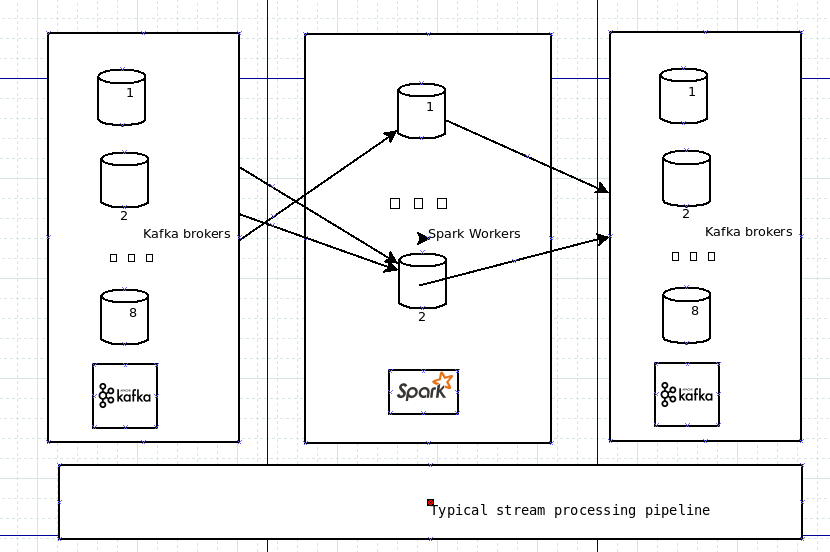
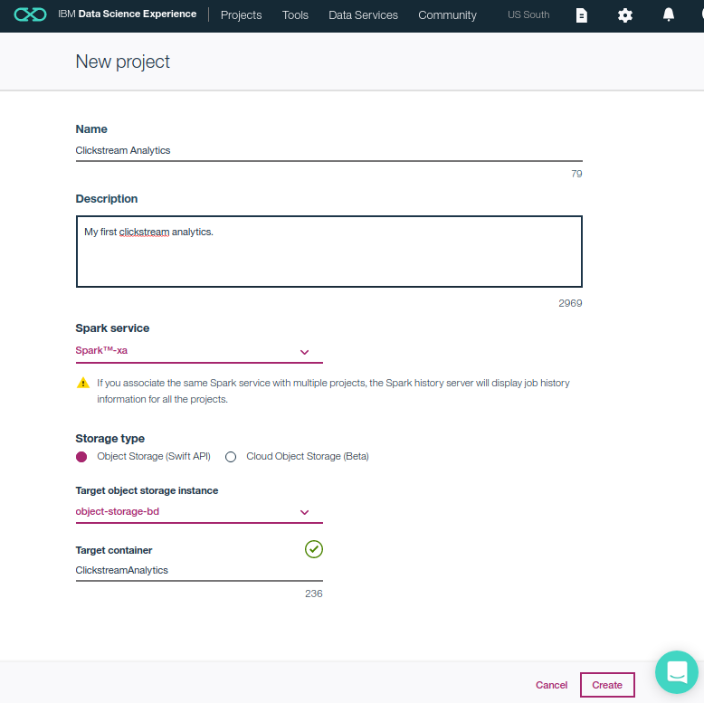
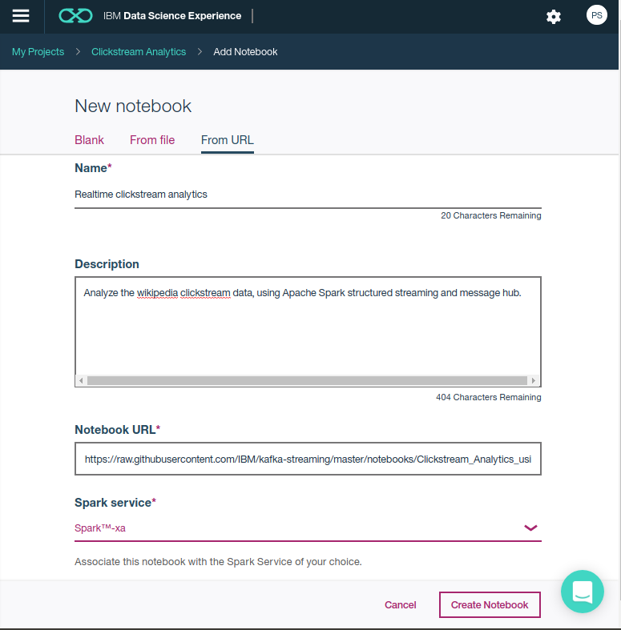

!! In Progress !!

## Clickstream Analysis using Apache Spark and Kafka

Clickstream analysis offers useful information about the usage characteristics of a website.

Some popular use cases include:

* <b>A/B Testing.</b> Statistically study how users of a web site are affected by changes from version A to B. [Read more](https://en.wikipedia.org/wiki/A/B_testing)
* <b>Recommendation generation on shopping portals.</b> By determining the order in which a user clicks on a web site, what influenced him/her to a buying decision can be ascertained. This information can be used as a recommendation generation for future such patterns of clicks. 
* <b>Targetted advertisement.</b> Simillar to recommendation generation, by tracking user clicks across websites, users of websites are served more precisely targetted advertisement.
* <b>Trending topics.</b> Clickstream can be used to study or report trending topics in real time. For a particular time quantum, display top items that gets highest number of user clicks. 

In this journey, we will demonstrate how to detect trending topics on 
[Wikipedia](https://www.wikipedia.org/) in real-time. Apache Kafka is used as a message queue, and the Apache Spark Structured Streaming processing engine is used to perform the analytics. This comnbination of is well known for its usability and high throughput, with low-latency characterstics.

When you complete this journey, you will understand how to:

* Perform clickstream analysis using Apache Spark Structured Streaming
* Build a low-latency processing stream utilizing Apache Kafka



## Flow

TBD

## Included components

* [Apache Spark](http://spark.apache.org/): An open-source distributed computing framework that allows you to perform large-scale data processing.
* [Apache Kafka](http://kafka.apache.org): Kafka™ is used for building real-time data pipelines and streaming apps. It is designed to be horizontally scalable, fault-tolerant and fast.

# Steps

There are two modes of exercising this journey:
* Run locally using a the Spark shell.
* [Run using a Jupyter notebook in the IBM Data Science Experience](#run-using-a-jupyter-notebook-in-the-ibm-data-science-experience).

## Run locally
1. [Install Spark and Kafka](#1-install-spark-and-kafka)
2. [Setup clickstream](#2-setup-clickstream)
3. [Run the script](#3-run-the-script)

### 1. Install Spark and Kafka

Install [Apache Kafka](https://kafka.apache.org/downloads) and [Apache Spark 2.2.0](https://spark.apache.org/releases/spark-release-2-2-0.html) on your system. 

### 2. Setup clickstream

In case an existing clickstream is not available for processing. A simulating clickstream can be used. An external publisher (simulating a real click stream) publishing to a topic `clicks`, on kafka running on <ip:port>, can be setup by 

1. Download the data from: [Wikipedia Clickstream data](https://meta.wikimedia.org/wiki/Research:Wikipedia_clickstream#Where_to_get_the_Data "Wikipedia clickstream data").
2. The Kafka distribution comes with a handy command line utility for this purpose, once the data is downloaded and extracted, run:

```
$ tail -200 data/2017_01_en_clickstream.tsv | KAFKA_OPTS="-Djava.security.auth.login.config=config/jaas.conf" bin/kafka-console-producer.sh --broker-list ip:port  --topic clicks --producer.config=config/producer.properties
```

*Note: One can use unix head or tail utilities for conveniently specifying the range of rows to be sent for simulating clickstream.*

### 3. Run the script

Go to the Spark install directory and bootstrap the Spark shell specifying 
the correct versions of Spark and Kafka:

```
$ cd $SPARK_DIR
$ bin/spark-shell --packages org.apache.spark:spark-sql-kafka-0-10_2.11:2.2.0
```

In the spark shell prompt, specify the schema of the incoming wikipedia clickstream 
and parse method:

```scala
scala> import scala.util.Try
import scala.util.Try

scala> case class Click(prev: String, curr: String, link: String, n: Long)
defined class Click

scala> def parseVal(x: Array[Byte]): Option[Click] = {
    val split: Array[String] = new Predef.String(x).split("\\t")
    if (split.length == 4) {
      Try(Click(split(0), split(1), split(2), split(3).toLong)).toOption
    } else
      None
  }
       |      |      |      |      |      | parseVal: (x: Array[Byte])Option[Click]
```

Setup structured streaming to read from Kafka:

```scala
scala> val records = spark.readStream.format("kafka")
                      .option("subscribe", "clicks")
                      .option("failOnDataLoss", "false")
                      .option("kafka.bootstrap.servers", "<ip:port>").load()
```

Process the records:

```scala
scala> 
    val messages = records.select("value").as[Array[Byte]]
                     .flatMap(x => parseVal(x))
                     .groupBy("curr")
                     .agg(Map("n" -> "sum"))
                     .sort($"sum(n)".desc)
```

Output to the console and start streaming:

```scala
val query = messages.writeStream
              .outputMode("complete")
              .option("truncate", "false")
              .format("console")
              .start()
```

```
scala> -------------------------------------------
Batch: 0

+---------------------------------------------+-------+
|curr                                         |sum(n) |
+---------------------------------------------+-------+
|Gavin_Rossdale                               |1205584|
|Unbreakable_(film)                           |1100870|
|Ben_Affleck                                  |939473 |
|Jacqueline_Kennedy_Onassis                   |926204 |
|Tom_Cruise                                   |743553 |
|Jackie_Chan                                  |625123 |
|George_Washington                            |622800 |
|Bill_Belichick                               |557286 |
|Mary,_Queen_of_Scots                         |547621 |
|The_Man_in_the_High_Castle                   |529446 |
|Clint_Eastwood                               |526275 |
|Beyoncé                                      |513177 |
|United_States_presidential_line_of_succession|490999 |
|Sherlock_Holmes                              |477874 |
|Winona_Ryder                                 |449984 |
|Titanic_(1997_film)                          |400197 |
|Watergate_scandal                            |381000 |
|Jessica_Biel                                 |379224 |
|Patrick_Swayze                               |373626 |
+---------------------------------------------+-------+
only showing top 20 rows

```

--------------------------------------------------------------

The resultant table shows the wikipedia pages with the maximum number of hits. This table updates automatically as soon as more data arrives from Kafka. Unless specified otherwise, structured streaming performs processing as soon as it sees any data.

Here we assume the higher number of clicks indicates a "Hot topic" or "Trending topic".
Please feel free, to contribute more ideas on how to improve and even more type of
clickstream analytics that can be done.

## Run using a Jupyter notebook in the IBM Data Science Experience

1. [Sign up for the Data Science Experience](#1-sign-up-for-the-data-science-experience)
2. [Create the notebook](#2-create-the-notebook)
3. [Run the notebook](#3-run-the-notebook)
4. [Save and Share](#4-save-and-share)

### 1. Sign up for the Data Science Experience

Sign up for IBM's [Data Science Experience](http://datascience.ibm.com/). By signing up for the Data Science Experience, two services: ``DSX-Spark`` and ``DSX-ObjectStore`` will be created in your Bluemix account. If these services do not exist, or if you are already using them for some other application, you will need to create new instances.

To create these services:
* Login to your [Bluemix](http://bluemix.net) account.
* Create your Spark service by selecting the service type [Apache Spark](https://console.bluemix.net/catalog/services/apache-spark). If not already used, name your service ``DSX-Spark``. 
* Create your Object Storage service by selecting the service type [Cloud Object Storage](https://console.bluemix.net/catalog/infrastructure/object-storage-group). If not already used, name your service ``DSX-ObjectStorage``.

> Note: When creating your Object Storage service, select the ``Swift`` storage type in order to avoid having to pay an upgrade fee.

Take note of your service names as you will need to select them in the following steps.

### 2. Create the notebook

First you must create a new Project:
* From the [IBM Data Science Experience page](https://apsportal.ibm.com/analytics) either click the ``Get Started`` tab at the top or scroll down to ``Recently updated projects``.
* Click on ``New project`` under ``Recently updated projects``.
* Enter a ``Name`` and optional ``Description``. 
* For ``Spark Service``, select your Apache Spark service name.
* For ``Storage Type``, select the ``Object Storage (Swift API)`` option.
* For ``Target Object Storage Instance``, select your Object Storage service name.
* Click ``Create``.



Create the Notebook:
* Click on your project to open up the project details panel.
* Click ``add notebooks``.
* Click the tab for ``From URL`` and enter a ``Name`` and optional ``Description``.
* For ``Notebook URL`` enter: https://github.com/IBM/kafka-streaming/blob/master/notebooks/Clickstream_Analytics_using_Apache_Spark_and_Message_Hub.ipynb
* For ``Spark Service``, select your Apache Spark service name.
* Click ``Create Notebook``.



### 3. Run the notebook

When a notebook is executed, what is actually happening is that each code cell in
the notebook is executed, in order, from top to bottom.

Each code cell is selectable and is preceded by a tag in the left margin. The tag
format is `In [x]:`. Depending on the state of the notebook, the `x` can be:

* A blank, this indicates that the cell has never been executed.
* A number, this number represents the relative order this code step was executed.
* A `*`, this indicates that the cell is currently executing.

There are several ways to execute the code cells in your notebook:

* One cell at a time.
  * Select the cell, and then press the `Play` button in the toolbar.
* Batch mode, in sequential order.
  * From the `Cell` menu bar, there are several options available. For example, you
    can `Run All` cells in your notebook, or you can `Run All Below`, that will
    start executing from the first cell under the currently selected cell, and then
    continue executing all cells that follow.
* At a scheduled time.
  * Press the `Schedule` button located in the top right section of your notebook
    panel. Here you can schedule your notebook to be executed once at some future
    time, or repeatedly at your specified interval.

**Note:** A message hub service can also be used in case an existing Kafka service is not available for testing. For this, one can add a data asset and create a message hub service. Credentials can be inserted using instructions given within the [notebook](notebooks/Clickstream_Analytics_using_Apache_Spark_and_Message_Hub.ipynb).

### 4. Save and Share

#### How to save your work:

Under the `File` menu, there are several ways to save your notebook:

* `Save` will simply save the current state of your notebook, without any version
  information.
* `Save Version` will save your current state of your notebook with a version tag
  that contains a date and time stamp. Up to 10 versions of your notebook can be
  saved, each one retrievable by selecting the `Revert To Version` menu item.

#### How to share your work:

You can share your notebook by selecting the “Share” button located in the top
right section of your notebook panel. The end result of this action will be a URL
link that will display a “read-only” version of your notebook. You have several
options to specify exactly what you want shared from your notebook:

* `Only text and output`: will remove all code cells from the notebook view.
* `All content excluding sensitive code cells`:  will remove any code cells
  that contain a *sensitive* tag. For example, `# @hidden_cell` is used to protect
  your dashDB credentials from being shared.
* `All content, including code`: displays the notebook as is.
* A variety of `download as` options are also available in the menu.

# License
[Apache 2.0](LICENSE)
