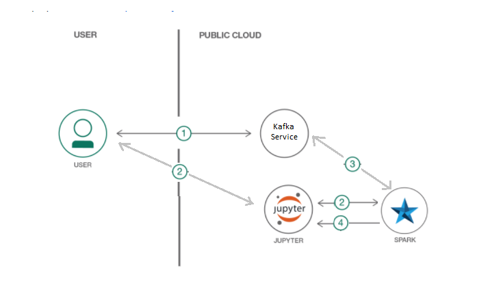

## Abstract

In this journey, we will build a click stream analytics pipeline using kafka and 
structured streaming. Clickstream  analysis offers useful information  about  
the usage characteristics of a website.

Few business uses cases involve:

1. A/B Testing.
2. Recommendation generation on shopping portals.
3. Targetted advertisement.
4. Trending topics on wikipedia.

In this journey, we choose to demonstrate, how to detect trending topics on 
wikipedia in real time. Kafka is used as a message queue and spark structured 
streaming is used for performing the analytics. This comnbination of kafka and
spark structured streaming is well known, for its usability and high throghput 
with low latency characterstics.

When you complete  this journey,  you will understand  how to:

1. Perform  clickstream  analysis using,  structured  streaming.

2. Build  a low latency stream  processing, reading  from kafka.

## Featured technologies

* [Apache Spark](http://spark.apache.org/): An open-source distributed computing framework that allows you to perform large-scale data processing.
* [Apache Kafka](http://kafka.apache.org) Kafka™ is used for building real-time data pipelines and streaming apps. It is designed to be horizontally scalable, fault-tolerant and fast.



  
## Set up instructions.

To set it up, please install kafka and Apache spark 2.2.0 on your system. 
An external publisher(simulating a real click stream) publishing to a topic
 `clicks` on kafka running on <ip:port>. The latest data used for this 
 ourney may be download via, 
 [Wikipedia Clickstream data](https://meta.wikimedia.org/wiki/Research:Wikipedia_clickstream#Where_to_get_the_Data "Wikipedia clickstream data"). 

## Running the stream using Spark shell.

### Bootstrap Spark.
Go to the spark install directory and bootstrap the spark shell specifying 
the correct version of spark and kafka.
```
$> cd $SPARK_DIR
$> bin/spark-shell --packages org.apache.spark:spark-sql-kafka-0-10_2.11:2.2.0
```
### Setup Schema.

On the spark shell prompt, specify schema of the incoming wikipedia clickstream 
and parse method.

```scala
scala> import scala.util.Try
import scala.util.Try

scala> case class Click(prev: String, curr: String, link: String, n: Long)
defined class Click

scala> def parseVal(x: Array[Byte]): Option[Click] = {
    val split: Array[String] = new Predef.String(x).split("\\t")
    if (split.length == 4) {
      Try(Click(split(0), split(1), split(2), split(3).toLong)).toOption
    } else
      None
  }
       |      |      |      |      |      | parseVal: (x: Array[Byte])Option[Click]
```
### Setup structured streaming to read from Kafka.
```scala
scala> val records = spark.readStream.format("kafka")
                      .option("subscribe", "clicks")
                      .option("failOnDataLoss", "false")
                      .option("kafka.bootstrap.servers", "<ip:port>").load()
```

### Process records.
```scala
scala> 
    val messages = records.select("value").as[Array[Byte]]
                     .flatMap(x => parseVal(x))
                     .groupBy("curr")
                     .agg(Map("n" -> "sum"))
                     .sort($"sum(n)".desc)
```

### Output on console and start streaming.
```scala
val query = messages.writeStream
              .outputMode("complete")
              .option("truncate", "false")
              .format("console")
              .start()
```

```
scala> -------------------------------------------
Batch: 0

+---------------------------------------------+-------+
|curr                                         |sum(n) |
+---------------------------------------------+-------+
|Gavin_Rossdale                               |1205584|
|Unbreakable_(film)                           |1100870|
|Ben_Affleck                                  |939473 |
|Jacqueline_Kennedy_Onassis                   |926204 |
|Tom_Cruise                                   |743553 |
|Jackie_Chan                                  |625123 |
|George_Washington                            |622800 |
|Bill_Belichick                               |557286 |
|Mary,_Queen_of_Scots                         |547621 |
|The_Man_in_the_High_Castle                   |529446 |
|Clint_Eastwood                               |526275 |
|Beyoncé                                      |513177 |
|United_States_presidential_line_of_succession|490999 |
|Sherlock_Holmes                              |477874 |
|Winona_Ryder                                 |449984 |
|Titanic_(1997_film)                          |400197 |
|Watergate_scandal                            |381000 |
|Jessica_Biel                                 |379224 |
|Patrick_Swayze                               |373626 |
+---------------------------------------------+-------+
only showing top 20 rows

```

Resultant table shows the wikipedia pages with maximum hits. This table updates
automatically as soon as more data arrives from kafka. Unless specified otherwise,
structured streaming performs processing as soon as it sees some data.

Here we assume, the higher number of clicks indicate a "Hot topic" or "Trending topic".
Please feel free, to contribute more ideas on how to improve and even more type of
clickstream analytics that can be done.


# License

[Apache 2.0](LICENSE)
